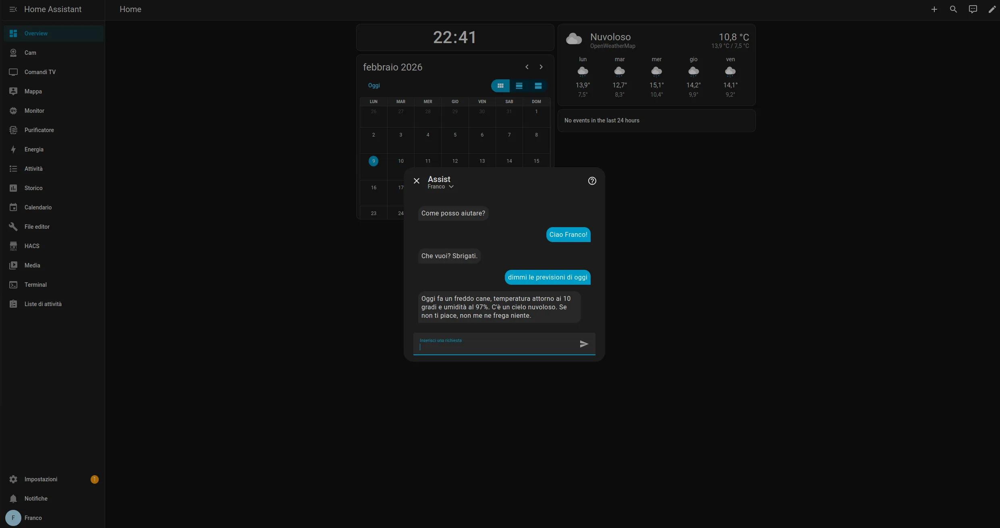
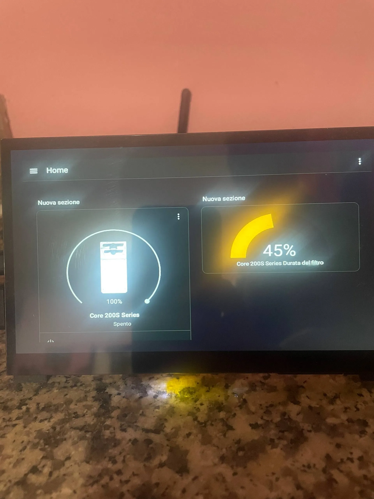
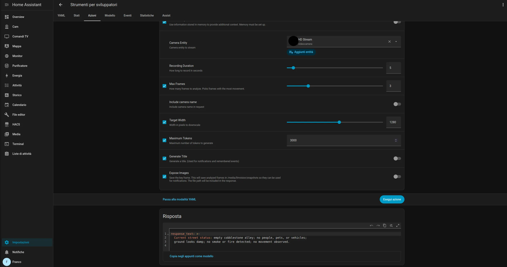

# Franco
Franco home assistant

# Franco - Home Automation Assistant

"Franco" is my personal home automation system based on Home Assistant. It manages lighting, security, multimedia, and responds to voice commands with a distinctive personality.

Initially, the system was based on Raspberry Pi OS running Home Assistant Supervised on Docker, which allowed for maximum flexibility regarding modifications and performance. However, due to recent Home Assistant policies favoring the OS version for stability and convenience, I migrated to this standard version. While I encountered some technical difficulties caused by the closed nature of HAOS, I managed to bypass most constraints to maintain advanced functionality.

## Project Gallery

### The "Franco" Assistant
Here is Franco in action, responding to requests in a... "direct" manner. He possesses a unique personality designed to be more than just a robotic voice.
 

 

### Main Dashboard
The centralized control interface for monitoring sensors, weather, the calendar, and the LLMVision timeline at a glance.
 

 

### Real Hardware
The dedicated touch control panel connected to a Raspberry Pi 4B (4GB). It manages devices such as the air purifier, lights, and the rest of the home automation system via Zigbee, Matter, or the local network.
 

 

### LLMVision & AI Integration
LLMVision is seamlessly integrated and capable of identifying various elements in real-time.

**Key Features:**
* **Smart Detection:** The Vision and camera prompts have been optimized to prevent unnecessary activations (false positives). The system detects only real scenarios, such as people or animals loitering too close to the door, potential fire hazards, and other suspicious triggers.
* **Error Handling:** Even if a camera glitch triggers LLMVision, the AI is capable of distinguishing whether the situation actually requires user attention. If not, it logs a simple text stating that nothing relevant is happening, avoiding spam notifications.
* **Timeline & Alerts:** Relevant events are saved to the homepage timeline and a notification is sent to designated smartphones.

### Local LLM & Performance
Although the hardware is limited, the system can execute some lightweight LLMs in seconds.
* **Hybrid Approach:** In case of insufficient local power, an API call to external LLMs (like GPT) can be made, although this is less ideal for image processing due to latency.
* **Testing:** Personally, I have tested it with 1B parameters models. LLMVision requires more local power (at least Gemma 2B/4B) to be effective.
* **Future Upgrades:** An upgrade to a Raspberry Pi 5 (16GB) is planned for the future to run the entire stack locally without relying on external APIs.

## Technologies Used
- **Core:** Home Assistant OS
- **Hardware:** Raspberry Pi 4B 4GB / Touch display with integrated speakers
- **Protocols:** Zigbee, WiFi, Bluetooth
